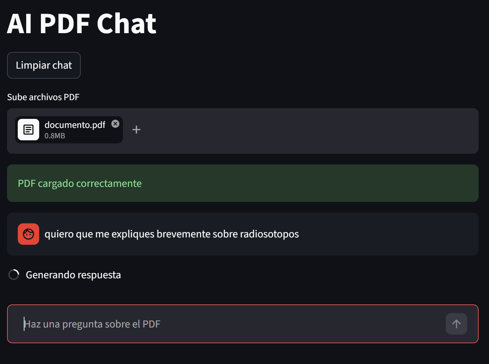
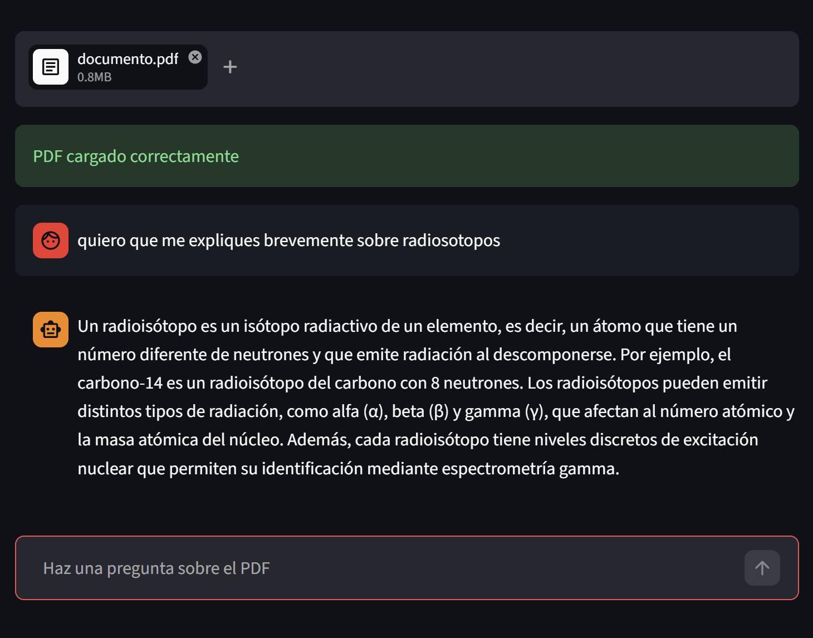
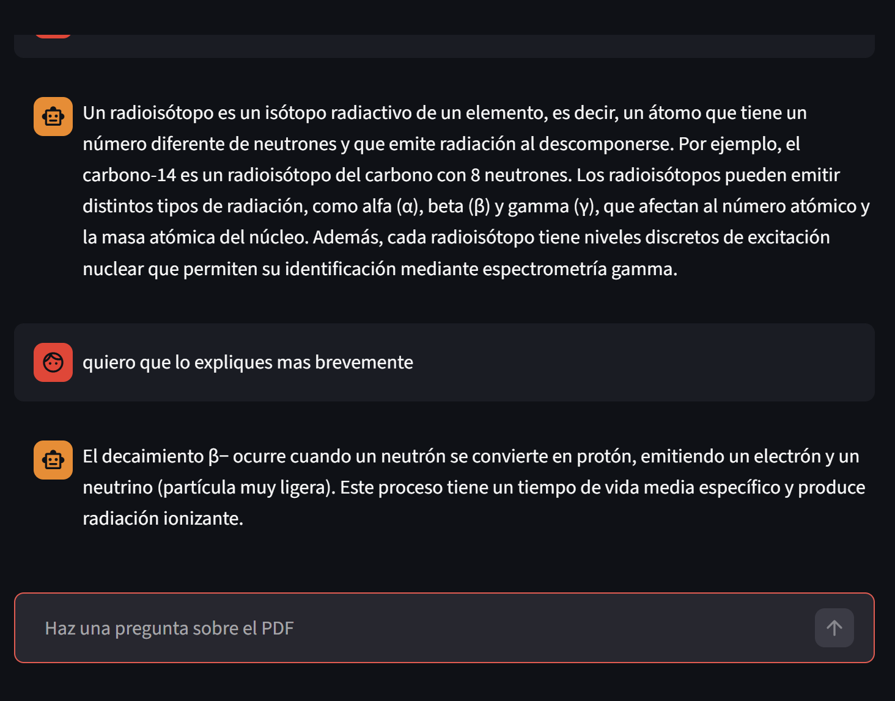

# AI PDF Chat RAG

AI PDF Chat es una aplicación web desarrollada con Python, Streamlit y OpenAI que permite subir uno o múltiples archivos PDF y hacer preguntas sobre su contenido utilizando inteligencia artificial.

La aplicación utiliza embeddings, búsqueda semántica y Retrieval-Augmented Generation (RAG) para responder preguntas de forma contextual y conversacional.

---

# 🚀 Features

- 📄 Subida de uno o múltiples PDFs
- ✂️ Extracción automática de texto
- 🧠 División inteligente en chunks
- 🔎 Embeddings con OpenAI
- 📚 Base vectorial FAISS
- 💬 Chat interactivo estilo ChatGPT
- 🧠 Memoria conversacional
- ⚡ Respuestas contextuales usando RAG
- 🧹 Botón para limpiar historial
- 🛡️ Manejo de errores
- 📏 Límite de tamaño para PDFs
- 🌐 Deployment online con Streamlit Cloud

---

# 🛠️ Tecnologías utilizadas

- Python
- Streamlit
- OpenAI API
- LangChain
- FAISS
- PyPDF
- RAG (Retrieval-Augmented Generation)

---

# 📸 Screenshots

## Interfaz principal



---

## Realizando preguntas



---

## Chat funcionando



---

# ⚙️ Cómo ejecutar el proyecto

## 1. Clonar repositorio

```bash
git clone https://github.com/TMORALES02/ai-pdf-chat-rag.git
```

---

## 2. Entrar al proyecto

```bash
cd ai-pdf-chat-rag
```

---

## 3. Crear entorno virtual

```bash
python -m venv .venv
```

---

## 4. Activar entorno virtual

### Windows

```bash
.venv\Scripts\activate
```

---

## 5. Instalar dependencias

```bash
pip install -r requirements.txt
```

---

## 6. Configurar API Key

Crear un archivo `.env`:

```env
OPENAI_API_KEY=tu_api_key
```

---

## 7. Ejecutar aplicación

```bash
streamlit run app.py
```

---

# 🌐 Demo Online

https://ai-pdf-chat-rag.streamlit.app/

---

# 📚 Qué aprendí

Durante este proyecto trabajé con:

- Arquitectura RAG
- Embeddings
- Vector Databases
- Semantic Search
- Prompt Engineering
- Streamlit
- Manejo de estado conversacional
- Deployment de aplicaciones IA

---

# 👨‍💻 Autor

Tomás Morales

GitHub:
https://github.com/TMORALES02